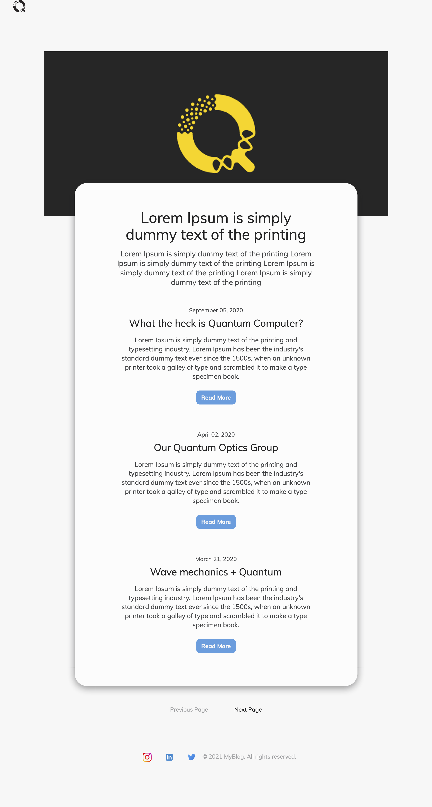
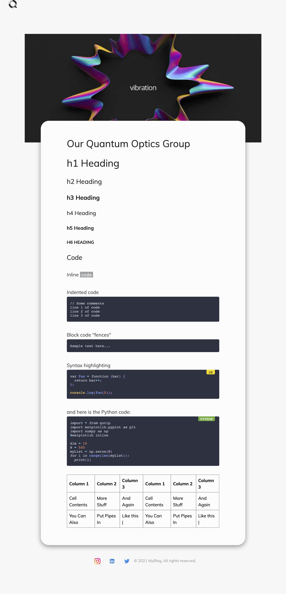
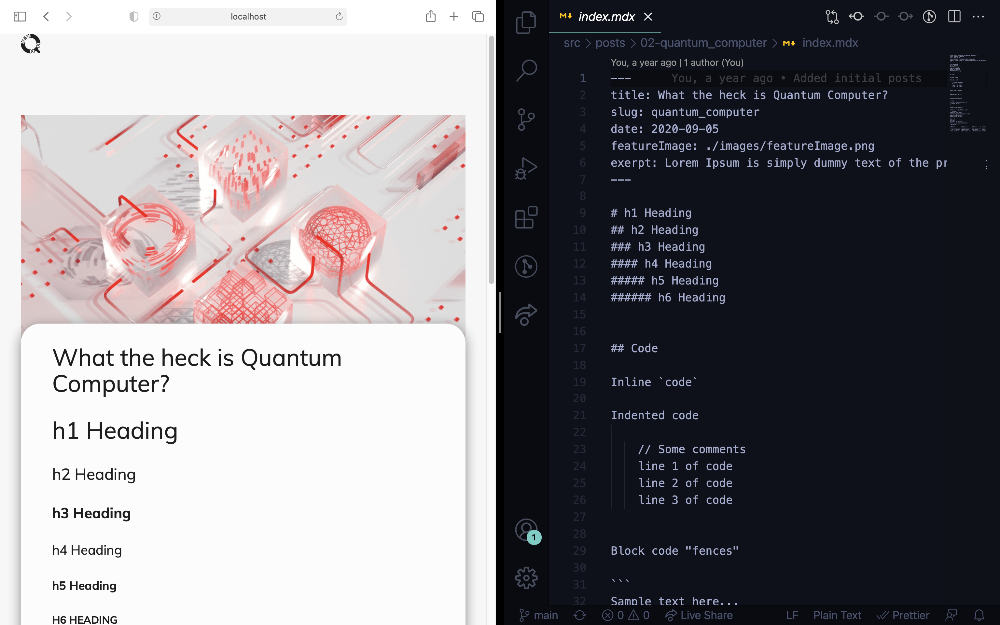
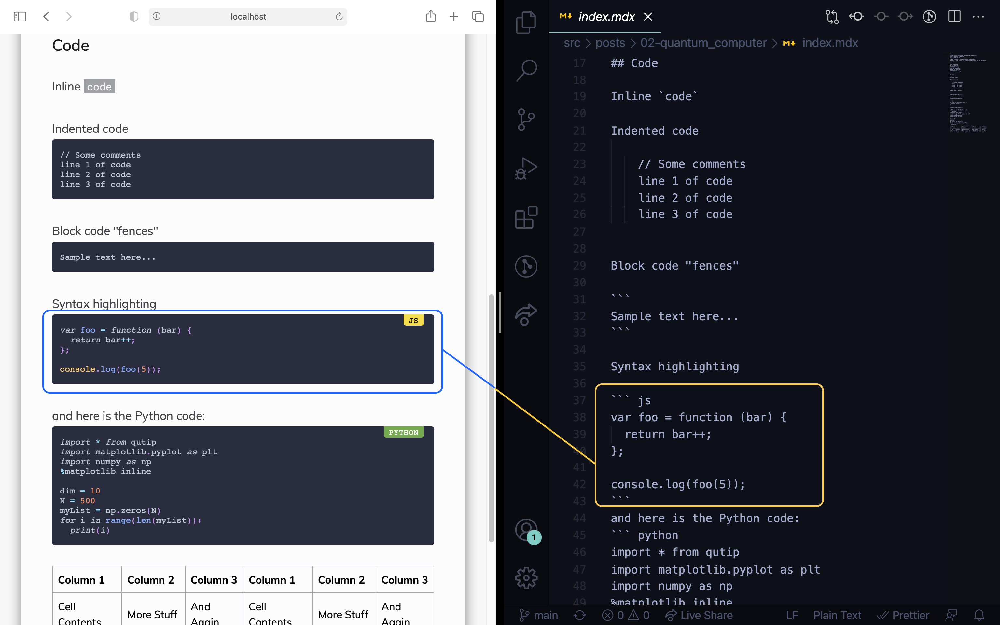

# Personal Blog
Source code of blog built by @hunterbecton using Gatsby JS. If you want to learn how to build this blog from scratch watch the videos in this [YouTube playlist](https://www.youtube.com/playlist?list=PLW0RabRDhwwzVNhlOgQQgw6HJzXdM1MnT).

# Usage:
1- install the **node package manager** (shortly `npm`)

2- change directory to the main folder (where the file `package.JSON` exists)

3- to install the packages listed in `packages.JSON` file run:
```bash
npm install
```

4- to go in the development mode run:
```bash
gatsby develop
# or
npm run develop
```
make changes and save them to see the results in your browser (mostly at `http://localhost:8000/`)

5- to build the website run:
```bash
gatsby build
# and then
gatsby serve
```
(mostly at `http://localhost:9000/`)

6- if everything thing is okay, you can deploy your website to [Netlify](https://www.netlify.com), [Vercel](https://vercel.com), [GitHub Pages](githubpages),... .

7- buy a domain and add it to your website

# Features:
1- It's static thus it's **very fast**

2- It uses **MDX** (MDX is an authorable format that lets you seamlessly write JSX in your Markdown documents)

3- **Syntax highlighting** using *Prism*

4- powerful **SEO**


# Shots:

|                    Main page                    |                      Post                       |
| :---------------------------------------------: | :---------------------------------------------: |
|  |  |




